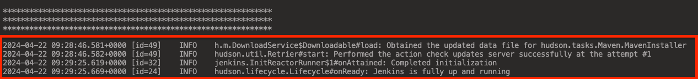

# Jenkins

&nbsp;

Reference : 

Run Jenkins with Docker Container : 
<pre>https://github.com/4bumuhammad/jenkins-docker-container</pre>

&nbsp;

&nbsp;

## Begin :

- &#x1F530; Test : Execute Shell

&nbsp;

    

 

&nbsp;

    

 

&nbsp;

    

 

&nbsp;

    

 

&nbsp;

    

 

&nbsp;

&nbsp;

&nbsp;

---

&nbsp;

- &#x1F530; Test : Execute Shell (next)

    

 

&nbsp;

    

 

&nbsp;

    

 

&nbsp;

    

 

&nbsp;

&nbsp;

&nbsp;

---

&nbsp;

- &#x1F530; Test : Execute Shell (next 2)

    

 

&nbsp;

    

 

&nbsp;

<pre>
    ❯ ls -lah /Users/.../Documents/test/docker-mount/jenkins_home/workspace/my_first_job

        drwxr-xr-x  3 &lt;user&gt;  staff    96B Apr 19 14:52 .
        drwxr-xr-x  4 &lt;user&gt;  staff   128B Apr 19 14:54 ..
        -rw-r--r--  1 &lt;user&gt;  staff    11B Apr 19 14:52 test.txt

    ❯ ccat /Users/.../Documents/test/docker-mount/jenkins_home/workspace/my_first_job/test.txt

        1234567890        
</pre>

&nbsp;

    

 

&nbsp;

&nbsp;

&nbsp;

---

&nbsp;

- &#x1F530; **Test : Python job**

Reference :  
Learn Jenkins! Complete Jenkins Course - Zero to Hero
<pre>https://www.youtube.com/watch?v=6YZvp2GwT0A</pre>
30.17

&nbsp;

Cleanly delete the current jenkins container and image because it doesn't have python installed in it. To make it easier, we will run and use the full version of the jenkins image.

<pre>
    ❯ docker rm -f $(docker ps -aq) && docker rmi -f $(docker images -q)

        c42df08a060f
        Untagged: jenkins/jenkins:jdk21
        Untagged: jenkins/jenkins@sha256:5d98ba5505a22b17393dfc6c471d3af540bcc72268d3f89adfa9cf0a9f2b9bf0
        Deleted: sha256:b2212b3b5405253435ed4d90dd53f4b21e7032f09d473ae43969f7f9b219aeb5
        Deleted: sha256:e9d6634782074fff222e9bfbf2f5fb777dc2c5f48a2c8880939c96034eaa2a7e
        Deleted: sha256:a63e8f3577555ae61eed8754cb1581bdaa125148cb9caf22fa3d34ebd3138ea0
        Deleted: sha256:4d09794c71bda02e2a0f372e3e4af8a70c792c956f59f1f7bd0d9990647616bc
        Deleted: sha256:768e577bafb86d6a48eb33dd276579b79c0afad8b710231859341a6ea64fa1d8
        Deleted: sha256:af105720372df7e6896df308d2f0d4331524506dc045d0d24eabf0f6185e2dc6
        Deleted: sha256:49aea36af1e3c95a5c22385419e366fe40ad17de2d39a50d6fd8a271eb802789
        Deleted: sha256:8f9e2d789acdd2097d5702a1112e62ad18052518f765d153e5bae17118f4f268
        Deleted: sha256:da6154c76e9bc8198d87dcba567225df9fe7e022e3c70e086fbeb6a293a854f1
        Deleted: sha256:a4177ddf3f14f4c0d0d4948d6f039950279b3522eba4f1c27c8ffbadcd7a2e41
        Deleted: sha256:cc07d9a41f969b71ed9136df010b41199196a7ca5dd9c5b3c5e8c1374287adf2
        Deleted: sha256:b1b83c13701d53945ccbbeb790310fb09b81c6574d987f05614d6f1f999652c5
        Deleted: sha256:7773f6e2f057e8defc1bfecd1d96414d8273040c8ac5cdaea2d03caef3692c27
</pre>

&nbsp;

---

&nbsp;

### Build the Jenkins Docker Image

<!-- <pre>
    ❯ docker images

        REPOSITORY                         TAG         IMAGE ID       CREATED         SIZE
        devopsjourney1/jenkins-blueocean   2.332.3-1   f0cea31942b5   11 months ago   781MB
        myjenkins-blueocean                2.332.3-1   f0cea31942b5   11 months ago   781MB

    ❯ docker network create jenkins

        90266d20a575d9021ad53eee8ad791de642a42f6ca470bb98e876c6890f0b2e2

    ❯ docker run --name jenkins-blueocean --restart=on-failure --detach \
            --network jenkins --env DOCKER_HOST=tcp://docker:2376 \
            --env DOCKER_CERT_PATH=/certs/client --env DOCKER_TLS_VERIFY=1 \
            --publish 8080:8080 --publish 50000:50000 \
            --volume /Users/powercommerce/Documents/test/docker-mount/jenkins/data:/var/jenkins_home \
            --volume /Users/powercommerce/Documents/test/docker-mount/jenkins/docker-certs:/certs/client:ro \
            myjenkins-blueocean:2.332.3-1

        WARNING: The requested image's platform (linux/amd64) does not match the detected host platform (linux/arm64/v8) and no specific platform was requested
        2261cc209d121c778c47aec4ae814ccb8b3403c066066c7a85cf4e9de87dbbec
</pre> -->

&nbsp;

The Dockerfile script file for jenkins includes python installed.
<pre>
    ❯ vim Dockerfile

        FROM jenkins/jenkins:2.440.3-lts

        USER root
        RUN apt-get update && \
            apt-get install -y \
            python3 \
            python3-pip \
            && apt-get clean \
            && rm -rf /var/lib/apt/lists/*

        EXPOSE 8080 50000

        USER jenkins
</pre>

&nbsp;

Build an image of the Dockerfile script.
<pre>
    ❯ docker build -t myjenkins/jenkins:2.440.3-lts .

        [+] Building 150.4s (6/6) FINISHED                                                                                                                                                                                          
        => [internal] load build definition from Dockerfile                                                                                                                                                                   0.0s 
        => => transferring dockerfile: 261B                                                                                                                                                                                   0.0s 
        => [internal] load .dockerignore                                                                                                                                                                                      0.0s 
        => => transferring context: 2B                                                                                                                                                                                        0.0s 
        => [internal] load metadata for docker.io/jenkins/jenkins:2.440.3-lts                                                                                                                                                 3.8s 
        => [1/2] FROM docker.io/jenkins/jenkins:2.440.3-lts@sha256:de4fea113221ab9e67567da3248abcb731dbe407056d0cab28cfa88bad9ae536                                                                                          98.4s 
        => => resolve docker.io/jenkins/jenkins:2.440.3-lts@sha256:de4fea113221ab9e67567da3248abcb731dbe407056d0cab28cfa88bad9ae536                                                                                           0.0s 
        => => sha256:de4fea113221ab9e67567da3248abcb731dbe407056d0cab28cfa88bad9ae536 3.12kB / 3.12kB                                                                                                                         0.0s 
        => => sha256:665ac20445a40ed26152b0843803786f5f4ef44dac816f5e0b42f9b9be197253 2.58kB / 2.58kB                                                                                                                         0.0s 
        => => sha256:7bc520724a1a906377ba19dc60ca86adfa75b42748583c9c5981e473ca3bbfa2 12.35kB / 12.35kB                                                                                                                       0.0s 
        => => sha256:1e92f3a395ff98a929e797a3c392bb6d0f05531068d34b81d3cd41ed6ce82ca4 49.60MB / 49.60MB                                                                                                                      37.7s 
        => => sha256:bf18644a36a52b170e59d313f05fb9f68b1615dcb436b5b6c1b8d62d7c0afc4e 8.25MB / 8.25MB                                                                                                                        13.5s 
        => => sha256:b4702c7673f1c80ba39f4a7b3b20fa908e622dd7ee655640c3960db5278c7e14 61.12MB / 61.12MB                                                                                                                      57.4s 
        => => sha256:4f445a566c9532f469bfe6c702768e7697a15b9cf9a1403cd999be2619738a0c 1.23kB / 1.23kB                                                                                                                        13.9s 
        => => sha256:c1f6789b0bcf11523c86d263d27739edfa6030dab89f9deeb8cc56e4a7f5e932 184B / 184B                                                                                                                            14.2s
        => => sha256:50acd283f613f1b50454c9fc2fd6cca1366ee670f7e020260abed4fa76a88285 93.28MB / 93.28MB                                                                                                                      96.9s
        => => sha256:7409fe8197606dd9c9ededed3d901cf3ecaae0f10a668807309fdd9d0dc4e33a 190B / 190B                                                                                                                            39.0s
        => => extracting sha256:1e92f3a395ff98a929e797a3c392bb6d0f05531068d34b81d3cd41ed6ce82ca4                                                                                                                              1.3s
        => => sha256:9f3e43a5a6fb13196b957feb21d315e8027237b688ba92a1368596b819f9dbc6 6.21MB / 6.21MB                                                                                                                        49.6s
        => => sha256:5b29115785db463913ca26c24421ef4ab42478a96cadb853f758e7d42ae5b2eb 62.66MB / 62.66MB                                                                                                                      94.6s
        => => extracting sha256:b4702c7673f1c80ba39f4a7b3b20fa908e622dd7ee655640c3960db5278c7e14                                                                                                                              1.5s
        => => sha256:1b74dc9dcd874ebb273c255ff11f86dbe07ef05eea7247f77070f3ae9b606dcf 1.92kB / 1.92kB                                                                                                                        58.3s
        => => sha256:074b15a3518d428f4ba1da66804c0ba56c96f7a243a08cc09b9f72878570b27e 1.23kB / 1.23kB                                                                                                                        58.7s
        => => sha256:ede1958e1e8f82bfa6fba790041c952357db5bd8b08aea1a2c5194624265cb13 391B / 391B                                                                                                                            59.1s
        => => extracting sha256:bf18644a36a52b170e59d313f05fb9f68b1615dcb436b5b6c1b8d62d7c0afc4e                                                                                                                              0.1s
        => => extracting sha256:4f445a566c9532f469bfe6c702768e7697a15b9cf9a1403cd999be2619738a0c                                                                                                                              0.0s
        => => extracting sha256:c1f6789b0bcf11523c86d263d27739edfa6030dab89f9deeb8cc56e4a7f5e932                                                                                                                              0.0s
        => => extracting sha256:50acd283f613f1b50454c9fc2fd6cca1366ee670f7e020260abed4fa76a88285                                                                                                                              0.2s
        => => extracting sha256:7409fe8197606dd9c9ededed3d901cf3ecaae0f10a668807309fdd9d0dc4e33a                                                                                                                              0.0s
        => => extracting sha256:9f3e43a5a6fb13196b957feb21d315e8027237b688ba92a1368596b819f9dbc6                                                                                                                              0.1s
        => => extracting sha256:5b29115785db463913ca26c24421ef4ab42478a96cadb853f758e7d42ae5b2eb                                                                                                                              0.8s
        => => extracting sha256:1b74dc9dcd874ebb273c255ff11f86dbe07ef05eea7247f77070f3ae9b606dcf                                                                                                                              0.0s
        => => extracting sha256:074b15a3518d428f4ba1da66804c0ba56c96f7a243a08cc09b9f72878570b27e                                                                                                                              0.0s
        => => extracting sha256:ede1958e1e8f82bfa6fba790041c952357db5bd8b08aea1a2c5194624265cb13                                                                                                                              0.0s
        => [2/2] RUN apt-get update &&     apt-get install -y     python3     python3-pip     && apt-get clean     && rm -rf /var/lib/apt/lists/*                                                                            46.7s
        => exporting to image                                                                                                                                                                                                 1.3s
        => => exporting layers                                                                                                                                                                                                1.3s
        => => writing image sha256:3a36e80722612bd9c2716c4ed383a66810d3c6bfd0d4c17375367d6be677e748                                                                                                                           0.0s
        => => naming to docker.io/myjenkins/jenkins:2.440.3-lts                                                                                                                                                               0.0s

        Use 'docker scan' to run Snyk tests against images to find vulnerabilities and learn how to fix them
</pre>

&nbsp;

Display the result as a new image.
<pre>
    ❯ docker images

        REPOSITORY          TAG           IMAGE ID       CREATED              SIZE
        myjenkins/jenkins   2.440.3-lts   3a36e8072261   About a minute ago   896MB
</pre>

&nbsp;

Run the image into a container that has been set up.
<pre>
    ❯ docker run -d \
        --name jenkins-container \
        -p 8080:8080 -p 50000:50000 \
        -v /Users/powercommerce/Documents/test/docker-mount/jenkins/home:/var/jenkins_home \
        myjenkins/jenkins:2.440.3-lts

    ❯ docker network create jenkins

        393f1481319c87f03eb229b52e1f01ff49b02ec5bd6d03e2b2f3275c88e9fef4

        

    ❯ docker run --restart=on-failure --detach \
        --network jenkins \
        --name jenkins-container \
        -p 8080:8080 -p 50000:50000 \
        -v /Users/powercommerce/Documents/test/docker-mount/jenkins/home:/var/jenkins_home \
        myjenkins/jenkins:2.440.3-lts

        
</pre>

&nbsp;

Display container list results.
<pre>
    ❯ docker ps -a

        CONTAINER ID   IMAGE                           COMMAND                  CREATED          STATUS          PORTS                                              NAMES
        997450ab3808   myjenkins/jenkins:2.440.3-lts   "/usr/bin/tini -- /u…"   20 minutes ago   Up 20 minutes   0.0.0.0:8080->8080/tcp, 0.0.0.0:50000->50000/tcp   jenkins-container
</pre>

&nbsp;

Open the logs container `jenkins-container` and wait for a few minutes for the following logs:
<pre>
    ❯ docker logs jenkins-container

        Running from: /usr/share/jenkins/jenkins.war
        webroot: /var/jenkins_home/war
        2024-04-22 09:22:20.634+0000 [id=1]     INFO    winstone.Logger#logInternal: Beginning extraction from war file
        2024-04-22 09:22:40.216+0000 [id=1]     WARNING o.e.j.s.handler.ContextHandler#setContextPath: Empty contextPath
        2024-04-22 09:22:40.249+0000 [id=1]     INFO    org.eclipse.jetty.server.Server#doStart: jetty-10.0.20; built: 2024-01-29T20:46:45.278Z; git: 3a745c71c23682146f262b99f4ddc4c1bc41630c; jvm 17.0.10+7
        2024-04-22 09:22:40.929+0000 [id=1]     INFO    o.e.j.w.StandardDescriptorProcessor#visitServlet: NO JSP Support for /, did not find org.eclipse.jetty.jsp.JettyJspServlet
        2024-04-22 09:22:41.018+0000 [id=1]     INFO    o.e.j.s.s.DefaultSessionIdManager#doStart: Session workerName=node0
        2024-04-22 09:22:42.334+0000 [id=1]     INFO    hudson.WebAppMain#contextInitialized: Jenkins home directory: /var/jenkins_home found at: EnvVars.masterEnvVars.get("JENKINS_HOME")
        2024-04-22 09:22:42.753+0000 [id=1]     INFO    o.e.j.s.handler.ContextHandler#doStart: Started w.@4d192aef{Jenkins v2.440.3,/,file:///var/jenkins_home/war/,AVAILABLE}{/var/jenkins_home/war}
        2024-04-22 09:22:42.760+0000 [id=1]     INFO    o.e.j.server.AbstractConnector#doStart: Started ServerConnector@78365cfa{HTTP/1.1, (http/1.1)}{0.0.0.0:8080}
        2024-04-22 09:22:42.765+0000 [id=1]     INFO    org.eclipse.jetty.server.Server#doStart: Started Server@5644dc81{STARTING}[10.0.20,sto=0] @22457ms
        2024-04-22 09:22:42.766+0000 [id=25]    INFO    winstone.Logger#logInternal: Winstone Servlet Engine running: controlPort=disabled
        2024-04-22 09:22:43.699+0000 [id=33]    INFO    jenkins.InitReactorRunner$1#onAttained: Started initialization
        2024-04-22 09:22:43.772+0000 [id=35]    INFO    jenkins.InitReactorRunner$1#onAttained: Listed all plugins
        2024-04-22 09:22:46.278+0000 [id=34]    INFO    jenkins.InitReactorRunner$1#onAttained: Prepared all plugins
        2024-04-22 09:22:46.290+0000 [id=32]    INFO    jenkins.InitReactorRunner$1#onAttained: Started all plugins
        2024-04-22 09:22:46.322+0000 [id=35]    INFO    jenkins.InitReactorRunner$1#onAttained: Augmented all extensions
        2024-04-22 09:22:46.772+0000 [id=35]    INFO    jenkins.InitReactorRunner$1#onAttained: System config loaded
        2024-04-22 09:22:46.772+0000 [id=35]    INFO    jenkins.InitReactorRunner$1#onAttained: System config adapted
        2024-04-22 09:22:46.772+0000 [id=31]    INFO    jenkins.InitReactorRunner$1#onAttained: Loaded all jobs
        2024-04-22 09:22:46.773+0000 [id=31]    INFO    jenkins.InitReactorRunner$1#onAttained: Configuration for all jobs updated
        2024-04-22 09:22:46.852+0000 [id=49]    INFO    hudson.util.Retrier#start: Attempt #1 to do the action check updates server
        2024-04-22 09:22:47.748+0000 [id=35]    INFO    jenkins.install.SetupWizard#init: 

        *************************************************************
        *************************************************************
        *************************************************************

        Jenkins initial setup is required. An admin user has been created and a password generated.
        Please use the following password to proceed to installation:

        1fe91f44db5d49c7956ce3a6b973aff9

        This may also be found at: /var/jenkins_home/secrets/initialAdminPassword

        *************************************************************
        *************************************************************
        *************************************************************

        2024-04-22 09:28:46.581+0000 [id=49]    INFO    h.m.DownloadService$Downloadable#load: Obtained the updated data file for hudson.tasks.Maven.MavenInstaller
        2024-04-22 09:28:46.582+0000 [id=49]    INFO    hudson.util.Retrier#start: Performed the action check updates server successfully at the attempt #1
        2024-04-22 09:29:25.619+0000 [id=32]    INFO    jenkins.InitReactorRunner$1#onAttained: Completed initialization
        2024-04-22 09:29:25.669+0000 [id=24]    INFO    hudson.lifecycle.Lifecycle#onReady: Jenkins is fully up and running
</pre>

&nbsp;

Make sure that the following log sections are present so that you can proceed to the next stage of the dashboard console.

    

 

&nbsp;

<pre>
    ❯ docker exec -it jenkins-container /bin/bash
        jenkins@997450ab3808:/$ python3 --version
        Python 3.11.2
</pre>

&nbsp;

&nbsp;

&nbsp;

---

&nbsp;

    

 

&nbsp;

---

&nbsp;

&nbsp;

&nbsp;
