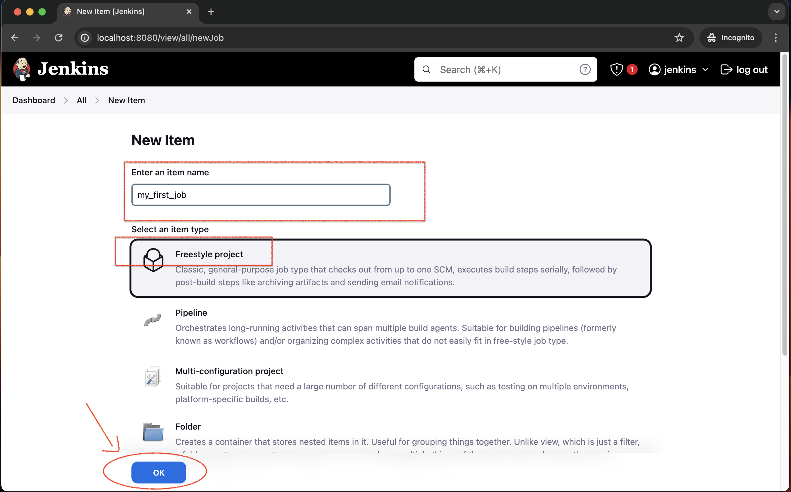
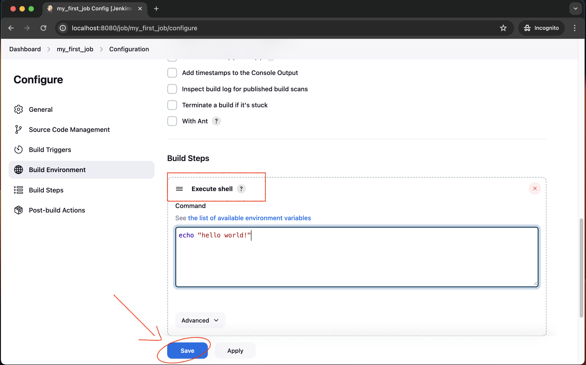
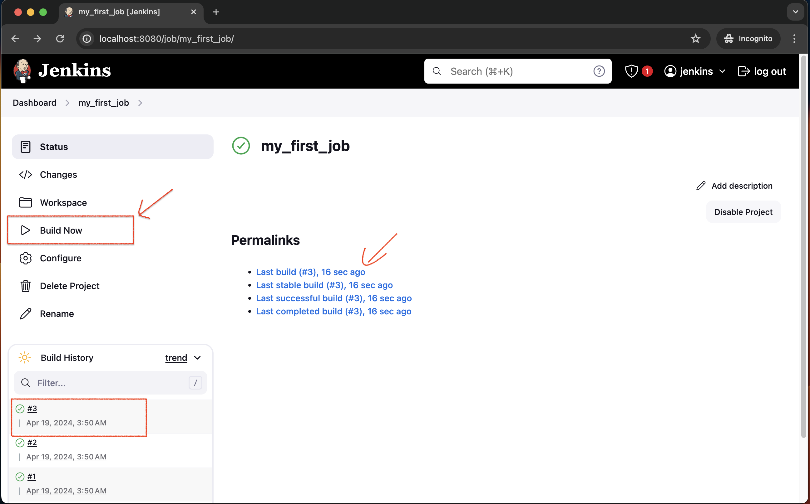
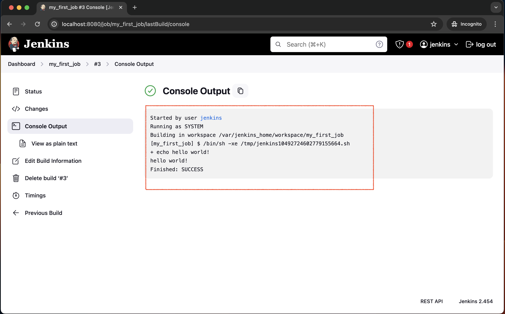
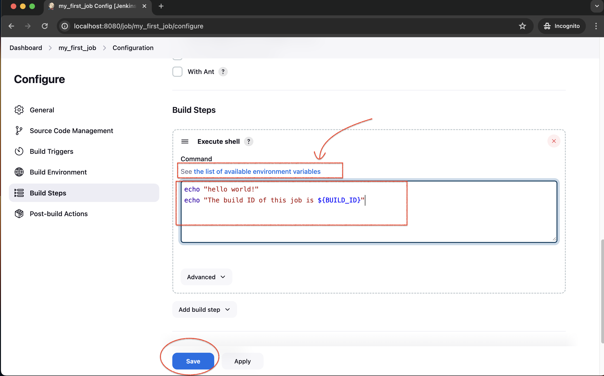
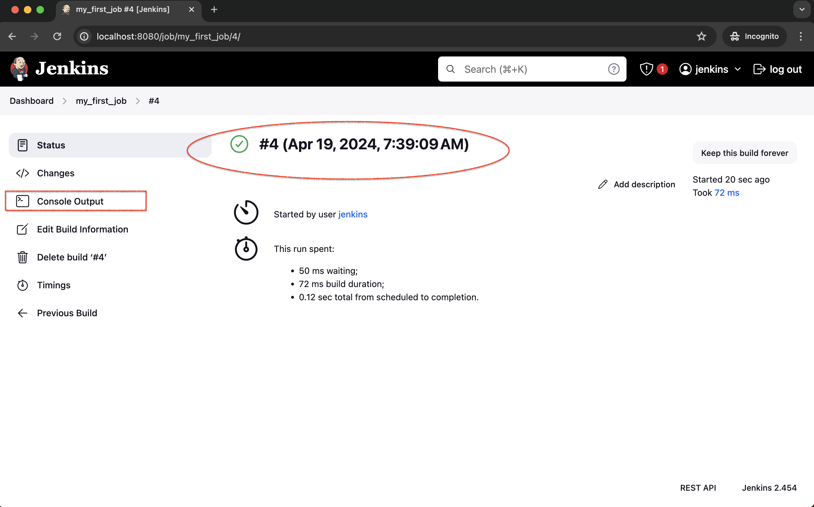
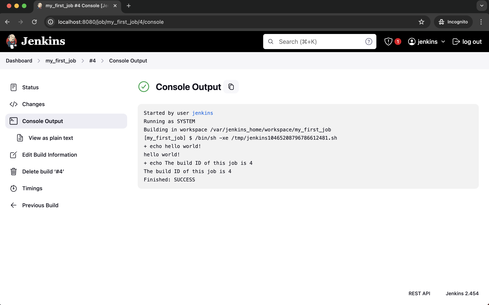
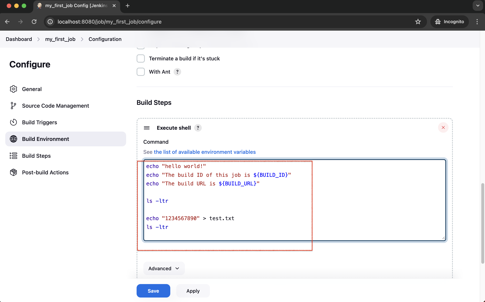
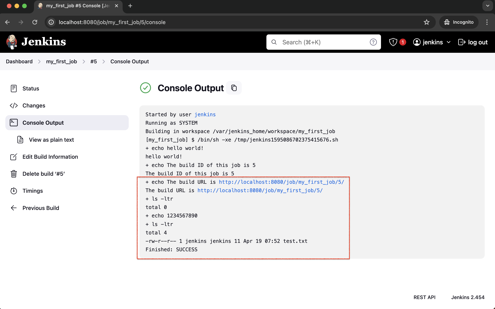

# Jenkins

&nbsp;

Reference : 

Run Jenkins with Docker Container : 
<pre>https://github.com/4bumuhammad/jenkins-docker-container</pre>

&nbsp;

&nbsp;

## Begin :

- Test : Execute Shell

&nbsp;

    

 

&nbsp;

    

 

&nbsp;

    

 

&nbsp;

    

 

&nbsp;

    

 

&nbsp;

&nbsp;

&nbsp;

---

&nbsp;

- Test : Execute Shell (next)

    

 

&nbsp;

    

 

&nbsp;

    

 

&nbsp;

    

 

&nbsp;

&nbsp;

&nbsp;

---

&nbsp;

- Test : Execute Shell (next 2)

    

 

&nbsp;

    

 

&nbsp;

<pre>
    ❯ ls -lah /Users/.../Documents/test/docker-mount/jenkins_home/workspace/my_first_job

        drwxr-xr-x  3 &lt;user&gt;  staff    96B Apr 19 14:52 .
        drwxr-xr-x  4 &lt;user&gt;  staff   128B Apr 19 14:54 ..
        -rw-r--r--  1 &lt;user&gt;  staff    11B Apr 19 14:52 test.txt

    ❯ ccat /Users/.../Documents/test/docker-mount/jenkins_home/workspace/my_first_job/test.txt

        1234567890        
</pre>

&nbsp;

    

 

&nbsp;

&nbsp;

&nbsp;

---

&nbsp;

- **Test : Python job**

Reference :  
Learn Jenkins! Complete Jenkins Course - Zero to Hero
<pre>https://www.youtube.com/watch?v=6YZvp2GwT0A</pre>
30.17

&nbsp;

Cleanly delete the current jenkins container and image because it doesn't have python installed in it. To make it easier, we will run and use the full version of the jenkins image.

<pre>
    ❯ docker rm -f $(docker ps -aq) && docker rmi -f $(docker images -q)

        c42df08a060f
        Untagged: jenkins/jenkins:jdk21
        Untagged: jenkins/jenkins@sha256:5d98ba5505a22b17393dfc6c471d3af540bcc72268d3f89adfa9cf0a9f2b9bf0
        Deleted: sha256:b2212b3b5405253435ed4d90dd53f4b21e7032f09d473ae43969f7f9b219aeb5
        Deleted: sha256:e9d6634782074fff222e9bfbf2f5fb777dc2c5f48a2c8880939c96034eaa2a7e
        Deleted: sha256:a63e8f3577555ae61eed8754cb1581bdaa125148cb9caf22fa3d34ebd3138ea0
        Deleted: sha256:4d09794c71bda02e2a0f372e3e4af8a70c792c956f59f1f7bd0d9990647616bc
        Deleted: sha256:768e577bafb86d6a48eb33dd276579b79c0afad8b710231859341a6ea64fa1d8
        Deleted: sha256:af105720372df7e6896df308d2f0d4331524506dc045d0d24eabf0f6185e2dc6
        Deleted: sha256:49aea36af1e3c95a5c22385419e366fe40ad17de2d39a50d6fd8a271eb802789
        Deleted: sha256:8f9e2d789acdd2097d5702a1112e62ad18052518f765d153e5bae17118f4f268
        Deleted: sha256:da6154c76e9bc8198d87dcba567225df9fe7e022e3c70e086fbeb6a293a854f1
        Deleted: sha256:a4177ddf3f14f4c0d0d4948d6f039950279b3522eba4f1c27c8ffbadcd7a2e41
        Deleted: sha256:cc07d9a41f969b71ed9136df010b41199196a7ca5dd9c5b3c5e8c1374287adf2
        Deleted: sha256:b1b83c13701d53945ccbbeb790310fb09b81c6574d987f05614d6f1f999652c5
        Deleted: sha256:7773f6e2f057e8defc1bfecd1d96414d8273040c8ac5cdaea2d03caef3692c27
</pre>

&nbsp;

### Build the Jenkins BlueOcean Docker Image (or pull and use the one I built) 

<pre>
    ❯ touch Dockerfile

    ❯ vim Dockerfile

        FROM jenkins/jenkins:2.414.2-jdk11
        USER root
        RUN apt-get update && apt-get install -y lsb-release python3-pip
        RUN curl -fsSLo /usr/share/keyrings/docker-archive-keyring.asc \
        https://download.docker.com/linux/debian/gpg
        RUN echo "deb [arch=$(dpkg --print-architecture) \
        signed-by=/usr/share/keyrings/docker-archive-keyring.asc] \
        https://download.docker.com/linux/debian \
        $(lsb_release -cs) stable" > /etc/apt/sources.list.d/docker.list
        RUN apt-get update && apt-get install -y docker-ce-cli
        USER jenkins
        RUN jenkins-plugin-cli --plugins "blueocean:1.25.3 docker-workflow:1.28"

</pre>

    ❯ docker build -t myjenkins-blueocean:2.414.2 .

&nbsp; 

Create the network 'jenkins'

<pre>
    docker network create jenkins
</pre>

&nbsp; 

    ❯ docker run --name jenkins-blueocean --restart=on-failure --detach \
        --network jenkins --env DOCKER_HOST=tcp://docker:2376 \
        --env DOCKER_CERT_PATH=/certs/client --env DOCKER_TLS_VERIFY=1 \
        --publish 8080:8080 --publish 50000:50000 \
        --volume /Users/powercommerce/Documents/test/docker-mount/jenkins/data:/var/jenkins_home \
        --volume /Users/powercommerce/Documents/test/docker-mount/jenkins/docker-certs:/certs/client:ro \
        myjenkins-blueocean:2.414.2

<pre>

</pre>

&nbsp;

<pre>
    ❯ docker images

        REPOSITORY        TAG       IMAGE ID       CREATED        SIZE
        jenkins/jenkins   2.440.3   7bc520724a1a   43 hours ago   498MB

    ❯ docker ps -a

        CONTAINER ID   IMAGE                     COMMAND                  CREATED          STATUS          PORTS                                              NAMES
        d753a6f9617b   jenkins/jenkins:2.440.3   "/usr/bin/tini -- /u…"   12 minutes ago   Up 12 minutes   0.0.0.0:8080->8080/tcp, 0.0.0.0:50000->50000/tcp   jenkins-container
</pre>

&nbsp;

<pre>
    ❯ docker logs jenkins-container

        Running from: /usr/share/jenkins/jenkins.war
        webroot: /var/jenkins_home/war
        2024-04-19 09:35:23.789+0000 [id=1]     INFO    winstone.Logger#logInternal: Beginning extraction from war file
        2024-04-19 09:35:44.278+0000 [id=1]     WARNING o.e.j.s.handler.ContextHandler#setContextPath: Empty contextPath
        2024-04-19 09:35:44.322+0000 [id=1]     INFO    org.eclipse.jetty.server.Server#doStart: jetty-10.0.20; built: 2024-01-29T20:46:45.278Z; git: 3a745c71c23682146f262b99f4ddc4c1bc41630c; jvm 17.0.10+7
        2024-04-19 09:35:45.154+0000 [id=1]     INFO    o.e.j.w.StandardDescriptorProcessor#visitServlet: NO JSP Support for /, did not find org.eclipse.jetty.jsp.JettyJspServlet
        2024-04-19 09:35:45.419+0000 [id=1]     INFO    o.e.j.s.s.DefaultSessionIdManager#doStart: Session workerName=node0
        2024-04-19 09:35:47.246+0000 [id=1]     INFO    hudson.WebAppMain#contextInitialized: Jenkins home directory: /var/jenkins_home found at: EnvVars.masterEnvVars.get("JENKINS_HOME")
        2024-04-19 09:35:47.794+0000 [id=1]     INFO    o.e.j.s.handler.ContextHandler#doStart: Started w.@4d192aef{Jenkins v2.440.3,/,file:///var/jenkins_home/war/,AVAILABLE}{/var/jenkins_home/war}
        2024-04-19 09:35:47.809+0000 [id=1]     INFO    o.e.j.server.AbstractConnector#doStart: Started ServerConnector@78365cfa{HTTP/1.1, (http/1.1)}{0.0.0.0:8080}
        2024-04-19 09:35:47.822+0000 [id=1]     INFO    org.eclipse.jetty.server.Server#doStart: Started Server@5644dc81{STARTING}[10.0.20,sto=0] @24294ms
        2024-04-19 09:35:47.823+0000 [id=25]    INFO    winstone.Logger#logInternal: Winstone Servlet Engine running: controlPort=disabled
        2024-04-19 09:35:49.161+0000 [id=33]    INFO    jenkins.InitReactorRunner$1#onAttained: Started initialization
        2024-04-19 09:35:49.291+0000 [id=33]    INFO    jenkins.InitReactorRunner$1#onAttained: Listed all plugins
        2024-04-19 09:35:53.447+0000 [id=33]    INFO    jenkins.InitReactorRunner$1#onAttained: Prepared all plugins
        2024-04-19 09:35:53.472+0000 [id=36]    INFO    jenkins.InitReactorRunner$1#onAttained: Started all plugins
        2024-04-19 09:35:53.506+0000 [id=31]    INFO    jenkins.InitReactorRunner$1#onAttained: Augmented all extensions
        2024-04-19 09:35:54.282+0000 [id=36]    INFO    jenkins.InitReactorRunner$1#onAttained: System config loaded
        2024-04-19 09:35:54.282+0000 [id=34]    INFO    jenkins.InitReactorRunner$1#onAttained: System config adapted
        2024-04-19 09:35:54.283+0000 [id=34]    INFO    jenkins.InitReactorRunner$1#onAttained: Loaded all jobs
        2024-04-19 09:35:54.284+0000 [id=34]    INFO    jenkins.InitReactorRunner$1#onAttained: Configuration for all jobs updated
        2024-04-19 09:35:54.379+0000 [id=49]    INFO    hudson.util.Retrier#start: Attempt #1 to do the action check updates server
        2024-04-19 09:35:55.434+0000 [id=36]    INFO    jenkins.install.SetupWizard#init: 

        *************************************************************
        *************************************************************
        *************************************************************

        Jenkins initial setup is required. An admin user has been created and a password generated.
        Please use the following password to proceed to installation:

        d4586404c2854cc59869d26ca0a7b113

        This may also be found at: /var/jenkins_home/secrets/initialAdminPassword

        *************************************************************
        *************************************************************
        *************************************************************

        2024-04-19 09:36:06.939+0000 [id=36]    INFO    jenkins.InitReactorRunner$1#onAttained: Completed initialization
        2024-04-19 09:36:06.978+0000 [id=24]    INFO    hudson.lifecycle.Lifecycle#onReady: Jenkins is fully up and running
        2024-04-19 09:36:08.443+0000 [id=49]    INFO    h.m.DownloadService$Downloadable#load: Obtained the updated data file for hudson.tasks.Maven.MavenInstaller
        2024-04-19 09:36:08.444+0000 [id=49]    INFO    hudson.util.Retrier#start: Performed the action check updates server successfully at the attempt #1
</pre>

&nbsp;
 
&nbsp;

&nbsp;

&nbsp;

&nbsp;

&nbsp;

&nbsp;

---

&nbsp;

    

 

&nbsp;

---

&nbsp;

&nbsp;

&nbsp;

